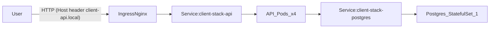

## Deliverables

1. Assignment
   1. Deployment
      1. [Kubernetes manifests](https://github.com/ng-aditya/assignment-1-devfinops/blob/main/code/cd/k8s/client-stack.all.yaml)
      2. [Helm chart](https://github.com/ng-aditya/assignment-1-devfinops/tree/main/code/cd/helm/client-stack)
   2. [Dockerfile](https://github.com/ng-aditya/assignment-1-devfinops/blob/main/code/ci/Dockerfile)
   3. [Source Code](https://github.com/ng-aditya/assignment-1-devfinops/tree/main/code/source)
   4. Submission doc - this!
2. [Entire Assignment](https://github.com/ng-aditya/assignment-1-devfinops)
3. [Docker image](https://hub.docker.com/r/ngaditya1/ng-a1-service-api)
4. [Service API url](http://localhost:9090/api/service/clients)
   1. `curl -H 'Host: client-api.local' http://localhost:9090/api/service/clients`

## Requirement understanding

Build and deploy a 2-tier system on Kubernetes:

- **Service/API tier**: an externally accessible microservice that fetches records from a database tier.
- **Database tier**: a database with a single table containing 5–10 records, with persistence so data survives pod recreation.

Kubernetes + platform requirements:

- **API tier**
  - 4 pods (replicas)
  - Rolling updates
  - Self-healing (pod recreation on failure/deletion)
  - HPA demonstration
  - Exposed outside the cluster via **Ingress**
  - CPU/memory requests & limits (FinOps)
  - DB config must be externalized via **ConfigMap**
  - DB password must be stored in **Secret** (not plain text in YAML)
- **DB tier**
  - 1 pod
  - Persistent storage
  - Internal-only access (no external exposure)
  - Recovers after pod deletion and keeps data

---

## Assumptions

- Kubernetes environment is a **local kind cluster** (Docker-based) for development and demo recording.
- Ingress is provided by **ingress-nginx**.
- Host port mapping for kind is **`9090 -> 80`** and **`9443 -> 443`** (if `80/443` is mapped port `:9090` can be omitted in curls).
- The API base path is configured with `quarkus.http.root-path=/api/service`.
- Seed data is acceptable as part of the initial DB migration (Flyway `V1__init.sql`) to satisfy “one table with 5–10 records”.

---

## Solution overview

### Components

- **API**: Quarkus (native image), virtual threads enabled.
  - Endpoint: `GET /api/service/clients`
  - DB connectivity via JDBC and connection pool (Agroal via Quarkus datasource)
  - Schema and seed data are created via **Flyway** at startup
- **Database**: Postgres

### Kubernetes objects (Helm chart)

Chart: `code/cd/helm/client-stack`

Concrete rendered manifests: `code/cd/k8s/client-stack.all.yaml`

- API tier
  - `Deployment` (replicas = 4, rolling update)
  - `Service` (ClusterIP)
  - `Ingress` (nginx)
  - `HorizontalPodAutoscaler` (CPU-based)
  - `ConfigMap` for DB host/port/name/user + pool settings
  - `Secret` for DB password
  - Liveness/readiness probes:
    - `/api/service/q/health/live`
    - `/api/service/q/health/ready`
- DB tier
  - `StatefulSet` (replicas = 1)
  - `Service` (ClusterIP only)
  - `Secret` for password
  - `PVC` for data persistence

### Traffic and data flow



---

## Justification for resources utilized (FinOps)

### API tier requests/limits

Configured in Helm values (`code/cd/helm/client-stack/values.yaml`):

- requests: CPU `10m`, memory `64Mi`
- limits: CPU `50m`, memory `128Mi`

Rationale:

- Requests/limits enable scheduling predictability and prevent noisy-neighbor issues.
- Requests are intentionally small for local demo environments and can be right-sized after observing real usage (`kubectl top pods`).

### HPA (CPU based)

HPA configured in Helm values:

- minReplicas: `2`
- maxReplicas: `8`
- target CPU utilization: `60%`

Rationale:

- Demonstrates elasticity under load and cost reduction during idle periods (scale-down).

---

## Cost optimization opportunities

1) **Right-size requests/limits using observed metrics**
   - Use `kubectl top pods` during normal and peak load
   - Reduce over-provisioned requests to improve bin-packing
2) **Use HPA to reduce idle capacity**
   - API scales down when CPU utilization drops under target
3) **Use native image + minimal runtime base image**
   - Multi-stage build produces a small runtime image (UBI minimal) to reduce runtime footprint and startup time
4) (Optional) **Cluster/node autoscaling** (if running in cloud)
   - Combined with HPA, reduces node count during low demand

---

## How to run (commands)

### Build image locally (native)

```bash
docker build -f code/ci/Dockerfile -t ngaditya1/ng-a1-service-api:1.0.0 code/source --load
```

### Load image into kind node (if docker hub is not accessible)

```bash
kind load docker-image ngaditya1/ng-a1-service-api:1.0.0 --name kind-cluster
```

### Install ingress-nginx (kind)

```bash
kubectl apply -f https://raw.githubusercontent.com/kubernetes/ingress-nginx/main/deploy/static/provider/kind/deploy.yaml
kubectl wait -n ingress-nginx --for=condition=ready pod -l app.kubernetes.io/component=controller --timeout=180s
```

### Deploy Helm chart

> **Secrets requirement**: Do not store DB passwords in YAML. Create the Secrets via CLI first.

```bash
kubectl create secret generic client-stack-api \
  --from-literal=DB_PASSWORD='clientsapp' \
  --dry-run=client -o yaml | kubectl apply -f -

kubectl create secret generic client-stack-postgres \
  --from-literal=POSTGRES_PASSWORD='clientsapp' \
  --dry-run=client -o yaml | kubectl apply -f -
```

```bash
helm upgrade --install client-stack code/cd/helm/client-stack \
  --set api.image.repository=localhost/ngaditya1/ng-a1-service-api \
  --set api.image.tag=1.0.0 \
  --set api.image.pullPolicy=IfNotPresent
```

### Deploy using concrete YAML (alternative to Helm)

This method applies the rendered YAML output from Helm directly (useful for understanding the final state).

1) Create Secrets (same as Helm method):

```bash
kubectl create secret generic client-stack-api \
  --from-literal=DB_PASSWORD='clientsapp' \
  --dry-run=client -o yaml | kubectl apply -f -

kubectl create secret generic client-stack-postgres \
  --from-literal=POSTGRES_PASSWORD='clientsapp' \
  --dry-run=client -o yaml | kubectl apply -f -
```

2) Apply the rendered manifests:

```bash
kubectl apply -f code/cd/k8s/client-stack.all.yaml
```

Notes:
- The rendered YAML intentionally **does not** include Secret values (assignment requirement). The Secrets must exist before applying.
- This will create the same core resources as Helm, but it will not create a Helm release record (no `helm status`/`helm rollback`).

### Verify

- In-cluster:

```bash
kubectl run curltest --rm -i --restart=Never --image=curlimages/curl:8.11.0 --command -- sh -lc \
'curl -s -o /dev/null -w "%{http_code}\n" http://client-stack-api/api/service/q/health && \
 curl -s http://client-stack-api/api/service/clients | head -c 200; echo'
```

- External (kind host mapping):

```bash
curl -H 'Host: client-api.local' http://localhost:9090/api/service/clients
```

---

## Metrics-server (for HPA + `kubectl top`)

HPA requires the Kubernetes Metrics API. On local clusters like **kind**, install `metrics-server` and patch it to scrape kubelets reliably.

### Install

```bash
kubectl apply -f https://github.com/kubernetes-sigs/metrics-server/releases/latest/download/components.yaml
```

### Patch for kind

```bash
kubectl -n kube-system patch deploy metrics-server --type='json' -p='[
  {"op":"add","path":"/spec/template/spec/containers/0/args/-","value":"--kubelet-insecure-tls"},
  {"op":"add","path":"/spec/template/spec/containers/0/args/-","value":"--kubelet-preferred-address-types=InternalIP,Hostname,ExternalIP"}
]'
kubectl -n kube-system rollout status deploy/metrics-server --timeout=180s
```

### Validate

```bash
kubectl top nodes
kubectl top pods
kubectl get hpa
kubectl describe hpa client-stack-api
```

---

## Demo checklist (video)

1) Show objects running:
   - `kubectl get all,ingress,hpa,pvc`
2) API call retrieves DB records:
   - `curl -H 'Host: client-api.local' http://localhost:9090/api/service/clients`
3) Self-healing (API):
   - `kubectl delete pod -l app.kubernetes.io/component=api`
4) Self-healing + persistence (DB):
   - `kubectl delete pod -l app.kubernetes.io/component=postgres`
   - Re-run API call to show data remains
5) Rolling update:
   - Build new tag, `kind load`, `helm upgrade`, then `kubectl rollout status deploy/client-stack-api`
6) HPA:
   - Show metrics-server installed and `kubectl top pods`
   - Generate load and show scaling with `kubectl get hpa -w`

